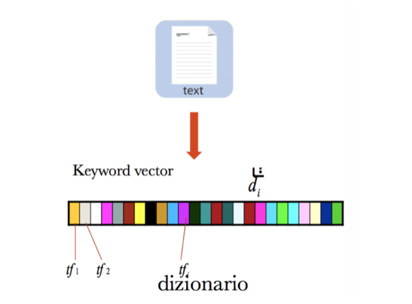

# TLN (Di Caro)

## Introduzione

Introduzione generale sul concetto di **semantica** (*statistica*, *linguistico-distribuzionale*, *lessicale* e *formale*).

### Semantica Computazionale

Semplificata in 4 tipi di semantiche:

- **lessicale**: come e cosa denotano le parole di una lingua (*lessico*).
- **formale**: nodello logico-matematici che definiscono il linguaggio.
- **statistica**: prettamente numerica
- **linguistico-distribuzionale**: comprende una
serie di teorie e metodi di linguistica computazionale per
lo studio della distribuzione semantica delle parole nel
linguaggio naturale.

### Le origini del trattamento del linguaggio naturale

Problema della comunicazione tra macchina e uomo. Inizialmente uno dei task principali era il ***Question Answering***:  la macchina leggeva un testo (**What**) e rispondeva alle domande dell’utente (**Why**) tramite l’utilizzo di risorse e codice (**How**).

Possono essere fatte molteplici domande, ed esiste un'area di ricerca che si occupa di categorizzarne il tipo e modellizzare tutti i modi in cui possono essere poste.

Per ogni domanda sono quindi necessarie una specifica analisi e un' associazione a diverse informazioni semantiche utili a risolvere i task di Questione Answering.

Inizialmente questo task era troppo complesso per la tecnologia del tempo. Oggi la ricerca non riguarda più il **QA**, ma tutto ciò che *sta dietro*: ci sono infatti comunità che lavorano sulla  ***Named Entity Recognition*** (**NER**), ossia identificare nel testo persone, luoghi, ecc..., altre che lavorano sulle relazioni tra esse, altre ancora sulla ***Word Sense Disambiguation*** (**WSD**). Altro esempio è dato da quelle che lavorano all'implementazione di un suggeritore automatico basato su un ***Language Model*** (**LM**), ossia un modello statistico che calcola la probabilità di avere una parola **$X$** dato un contesto **$\Gamma$** che la precede (suggeritore testo del telefono).

## Significato del significato

### Definizioni di base

Alcune utili nozioni di base:

- ***Lessico***: dizionario, ossia tutti gli elementi che si hanno a disposizione per costrutire una frase.
- ***Sintassi***: come gli elementi del dizionario possono essere collegati tra loro attraverso una struttura che permette di costruire frasi.
- ***Semantica***: interpretazione di una struttura lessico-sintattica a cui attribuisce un significato.
- ***Pragmatica***: disciplina della linguistica che si occupa dell’uso contestuale della lingua, ovvero di come il contesto influisca sull’interpretazione dei significati prescindendo dall’uso di lessico e sintassi. Per ***Contesto*** si intende ***Situazione***, ossia l'insieme dei fattori extralinguistici che influenzano gli atti linguistici.
- ***Ambiguità***: proprietà del linguaggio che permette di esprimere e comunicare utilizzando un minor numero di parole.
- ***Polisemia***: fenomeno per cui una parola può esprimere più significati.
- ***Omonimia***: fenomeno per cui una stessa forma ortografica e fonologica esprime più significati.
- ***Differenza tra polisemia ed omonimia***:  nell'***omonimia***, le parole sono più di una e hanno significato diverso; nella ***polisemia***, invece, la parola è sempre la stessa, ma il suo significato originario si è esteso ad altri referenti.
- ***Comunicazione***: Strumento che permette di condividere i significati che sono all’interno della nostra mente.
- ***Convenzione***: Meccanismo con cui veicolare il contenuto semantico attraverso dei simboli.
- ***Granularità***: Dimensione qualitativa che caratterizza i modi in cui vengono concettualizzate le situazioni che si vogliono descrivere, muta il significato della parola in base ai dettagli con cui la vediamo.
- ***Soggettività***: Il linguaggio è solo un’approssimazione delle immagini mentali e quindi è soggetto ad errori che possono portare a interpretazioni errate.
- ***Similarità***: Meccanismo che permette di inferire il significato di un termine sconosciuto attraverso la sua associazione con uno simile conosciuto.
- ***Esperienza personale***: Insieme di tutti gli eventi della vita che formano la conoscenza di un singolo individuo.
- ***Senso comune***: Convenzioni che stabiliscono il significato che la collettività dà ad alcuni termini, una sorta di esperienza condivisa.
- ***Cultura***: Il significato di alcune parole è legato alla convenzione della cultura nella quale ci si trova e cambia di cultura in cultura.

#### Frammenti di ontologia

Attraverso queste informazioni possiamo dire di aver creato un'***ontologia***, condividendo il significato dei concetti di un certo dominio. Non vi è più interesse per il significato del singolo concetto, ma per quello condiviso che gli viene attribuito.

### Il significato delle parole

Ci sono 3 principali teorie sul ***word meaning***:

1. ***Basate su primitive***: per rappresentare il significato di una parola questo viene frammentato in piccoli contenuti semantici di natura atomica.
**[ES]**: per comprendere il significato di *"scrivania"* devo prima comprendere quello di *"tavolo"*, quindi di una struttura che abbia un *"piano"* con delle fondamenta. Ci permette di apprendere significati unovi e relazionarli coi vecchi.
2. ***Basate su relazioni***: il significato di una parola nasce dalle relazioni che ha con le altre. Una parola da sola non ha alcun significato, serve un contesto.
3. ***Basate su composizioni***: oltre al significato delle stesse, ottengo il significato dato dalla congiunzione delle due parole con una certa dipendenza sintattica (poste vicine).

### Il Triangolo Semiotico

Questo triangolo è un modello del significato: esso dice che ogni concetto che si ha in mente è rappresentabile attraverso un triangolo che ha come vertici:

- il ***Concetto*** (*Significato* o *Interpretazione*) stesso, che corrisponde semplicemente a ciò che si ha nella mente senza utilizzo di alcuna convenzione. *["gatto"]*
- il ***Referente*** (*Fenomeno* o *Istanza*) è un qualsisasi elemento nel mondo reale. *["un qualsiasi gatto"]*
- la ***Rappresentazione*** (*Segni*, *Termini* e *Simboli*), dove si utilizza un simbolo convenzionale che ci permette di comunicare il concetto. *[ita: "gatto", eng: "cat"]*

***AI*** ed ***NLP*** si collocano sul vertice della rappresentazione e si estendono verso gli altri due.

### Multilinguismo

Le ***barriere linguistiche*** per l'NPL sono viste non solo come una sfida, ma anche come un'opportunità: un testo un più lingue, infatti, può essere studiato semanticamente e i risultati ottenuti possono essere allineati e integrati per:

- capire quali sono le informazioni semantiche più importanti o più certe o maggiormente condivise.
- migrare informazioni semantiche ritrovate su una lingua
su di un’altra lingua.

***Rarità di una lingua***: più una lingua è rara, più il suo processamento può risultare complesso, in quanto più del **$90\%$** delle risorse sono in lingua inglese.

Un altro problema è raccogliere tutte le sfumature di una lingua come i ***modi di dire***, ***usanze*** e ***convenzioni***, non lessicalizzati in tutte le lingue *["mamma mia", "anduma", "abbiocco"]*.

### Granularità

Visione che si ha sulla struttura semantica, e può essere a livello di:

- ***Parola***: complessità già elevata (***WSD***).
- ***Chunk***: composizione di parole **$(aggettivo + nome)$** (***multiword expressions***).
- ***Frase***: si possono già risolvere problemi di ***Question Answering***.
- ***Discorso***: i ***chatbot***.
- ***Documento***: problemi di ***summarizzazione*** a livello di documento. Possono essere ***estrattivi*** o ***astrattivi***: i primi estrapolano le parti significative del testo, i secondi creano una rappresentazione dell'intero documento generando nuove frasi che cercano di riassumere le parti salienti della semantica del documento originale.
- ***Collezione di Documenti***: a questo livello emerge il ***topic modeling***, che cerca di estrapolare gli argomenti principali contenuti all’interno dei documenti.

### Word Sense Disambiguation (WSD)

Identificazione del senso di una parola polisemica in una frase, e quindi all’interno di un determinato contesto. Problemi:

- ***Specificità***: molti sensi attribuiti alle parole non vengono mai utilizzati in quanto troppo specifici, anzi rappresentano del rumore nell’analisi del linguaggio naturale.
- ***Copertura***: molte zone del linguaggio non sono coperte
- ***Soggettività***: nonostante le decisioni sul senso da attribuire a una parola siano prese collettivamente, restano comunque soggettive.

### Word Sense Induction (WSI)

Identificazione automatica dei sensi di una parola dato il suo utilizzo in tantissimi testi, catturando tutti quelli che sono i contesti che danno un senso preciso e differente dagli altri alla parola.

#### Differenze WSI e WSD

- In WSD dobbiamo "disambiguare", quindi occorre un *Sense Inventory* da cui attingere, mentre nel WSI non ci si appoggia su alcuna risorsa, ma solo basandosi sull'utilizzo della parola all'interno di grandi quantità di dati.
- WSD molto basata sulla grammatica, mentre la WSI sull'uso delle parole ed è spetto sgrammaticata.
- Valutare la disambiguazione è pià semplice, ma più citicabile, mentre WSI è più complessa, perchè non avendo un dizionario, deve fare una specie di ***clustering***, ossia guardare tutte le parole all'interno di una finestra e vedere con cosa la parola scelta co-occorre. Mettendo assieme tutti questi contesti simili si creano dei ***cluster coerenti*** che si possono usare per attribuire il senso.

#### Metodo della pseudoword

Metodo per la valutazione nei WSI tanto banale quanto efficace. Supponiamo di avere Wikipedia e prendere due termini a caso, come *"banana"* e *"cane"*. Vengono entrambi sostituiti con la parola *"bananacane"*. Il sistema di valuazione applicerà il sistema WSI alla parola *"bananacane"* e cerca di capire se creerà un cluster dove il senso è "banana" e un altro in cui è "cane". In pratica si crea una parola che non esiste unendo due parole e poi si valuta il WSI in base ai cluster che crea.

### Definizione delle definizioni e ricerca onomasiologica

Sono disponibili diverse risorse lessico-semantiche:

- ***Dizionari elettronici***: *WordNet*, *BabelNet*, ecc...
- ***Risorse linguistico-cognitive***: *Property norms* sono studi cognitivi volti a comprendere dinamiche, come la mutazione del linguaggio dopo un trauma.
- ***Common-sense knowledge***: informazione di tipo "common-sense" (*ConceptNet*)
- ***Visual Attributes***:  risorse che si basano sulla fisionomia degli oggetti.
- ***Corpus managers***:  piattaforma in grado di gestire database testuali per la ricerca e l’esplorazione. Un esempion è *SketchEngine*.

Queste risorse lessico-semantiche si basano quasi tutte sul concetto di ***definizione***, ovvero la descrizione di una parola attraverso l’uso di altre parole. Come è possibile descrivere una parola con altre parole?

**[Esercitazioni 1 e 2]**

## Costruzione del Significato
Costruzione del significato usando i principi di composizionalità attraverso due teorie: Pustejovsky e Patrick Hanks.
### Pustejovsky
Teoria della semantica linguistica chiamata ***"Generative Lexicon"***, che usa una struttura basata su:
- ***Argument Structure***: esprime il legame tra *sintassi* e *semantica* del concetto (come mappare quello che si vuole esprimere su quel concetto con parole, lettere e grammatica).
- ***Event Structure***: esprime tutti i tipi di eventi che coinvolgono quel concetto, come lo stato, il processo o la transizione.
- ***Qualia Structure***: esprime la struttura del concetto, ovvero come sono definite le sue caratteristiche (Pustejovsky *qualia*).
- ***Inheritance Structure***: colloca il concetto all'interno di una tassonomia per poterne comprendere già a grandi linee il significato (se ho *bananana* devo sapere che è un frutto).

Pustejovsky sostiene che per poter ragionare semanticamente in maniera precisa e completa abbiamo bisogno di formalizzare e definire in modo preciso tutte queste strutture.

### Qualia Structure
Esistono 4 ruoli di Qualia:
- ***Costitutivo***: esprime la parte di composizione del concetto (peso, dimensione e parti che lo compongono).
- ***Formale***: esprime le caratteristiche che definiscono il concetto e lo distinguono dagli altri nello stesso dominio.
- ***Telico***: esprime l'obiettivo o la funzione del concetto
- ***Agenitive***: esprime l'origine del concetto attraverso entità umane o artificiali o eventi

In questa teoria, ogni elemento ha un ruolo e una struttura in base ai concetti definiti da Pustejovsky. Si può poi prendere ogni frase che contiene uno di questi concetti e analizzarla in modo formale attraverso un modello semantico basato sul lessico, fornendo quindi una rappresentazione formale della semantica delle frasi. 

Il problema di questa teoria è che è complessa e difficile da implementare.

### Hanks
Diventato importante per la teoria del ***Corpus Pattern Analisys (CPA)***, ma noi vedremo solo quella delle ***Valenze***, che è più semplice e da comprendere e implementare.

Si basa sul concetto che il ***verbo*** sia la ***radice del significato***, in quanto secondo lui *"non esiste un'espressione di significato snza un verbo"*. Partendo dal verbo, si va poi ad osservare la valenza di un concetto.

***Valenza***: cardinalità degli argomenti che compongono la struttura di cui il verbo è radice.
Posso avere verbi ***transitivi***, ***intransitivi*** (*Piove*, non ha argomenti) e ***a diversi livelli di trasitività con $n$ argomenti*** (*Porto la macchina a Torino*, con 3 argomenti: *io*, *la macchina* e *a Torino*).

In base a quanti argomenti utilizziamo varia il significato del verbo. Ogni Valenza rappresenta quindi un certo numero di argomenti, chiamati ***slot***, e ogni possibile valore che essi possono assumere è detto ***filler***.

Quindi, dato un verbo e una valenza Hanks introduce due concetti:
- ***Collocazione***: combinazione di tutti i possibili *filler*.
  Dato *"io vado lì"* di valenza $2$, per ogni slot vengono recuperati tutti i filler:
  - ***slot1***: tutti i soggetti
  - ***slot2***: tutti i luoghi in cui quei soggetti possono andare.
- ***Semantic Type***: macro-categorie che servono a raggruppare i vari filler.
  Per le occorrenze *"lo studente va ..."*, *"Michela va"*, ecc... la macro-categoria semantica associataa questi filler sarebbe *"Persona"*.

una volta collezionati tutti i filler e raggruppati per Semantic Type, Hanks dice che ogni significato dipende dalla combinazione dei Semantic Type degli argomenti. 

Se ho il Semantic Type di tipo 1 per il primo argomento e quello di tipo 3 per il secondo, questa combinazione con due argomenti per quel verbo rappresenta un significato preciso. Poi vado a catturare tutte le variazioni sintattiche che rappresentano lo stesso significato e le accoppio in un'unica combinazione, riducendo così lo spazio tenuto da tutti i significati espressi da quel verbo.

#### Problematiche
Identificazione dei Semantic Type e grado di generalizzazione.

Le due righe legate rappresentano una variazione sintattica.

Spesso non si hanno sufficienti dati per tutte le parole, rendendo difficile la loro analisi semantica. I termini nei dati possono non sovrapporsi anche se simili, e si riferiscono a concetti a un certo livello di generalizzazione dipendente dal contesto. 

### Affordance linguistiche
Soluzione alle problematiche della teoria di Hanks.
##### Teoria dell'Affordance
Dato un oggetto percepibile coi sensi, anche se non lo si è mai visto prima, è possibile capire come utilizzarlo in quanto l'oggetto di per sè fornisce dei suggerimenti d'uso.

Questa teoria si può proiettare anche sul linguaggio e si può dire che ogni parola ha un suo possibile utilizzo e questo può essere intuito.

Se prendo la parola *"grest"*, da sola non mi dice nulla. Ma se la trovo all'interno della frase *"Yesterday e saw a grest"* intuisco che è qualcosa che si può vedere. Grazie al contesto possiamo intuire quindi il significato di un termine che non conosciamo. 

#### Potenza generativa dei pattern
***Pattern***: frase che contiene dei jolly ***\**** [*"Lorem * dolor sit * "*].

***Linguistic Instances***: tutte le occorrenze di un dato pattern all'interno di un dato corpus.

Un jolly potrebbe ovviamente avere più filler (parole che matchano con esso). Potesimo associare tutte le proprietà a quei filler, sarebbe possibile raggrupparle con concettualizzazioni: si andrebbero a legare le co-occorrenze dei filler per ciascun jolly, creando dei cluster.

Ogni volta che si ha un pattern con delle proprietà per un asterisco, allora il jolly successivo avrà un'altro insieme di proprietà e così via. Questi cluster racchiudono le proprietà che quel jolly deve avere per avere un senso compiuto in quel contesto. 

A patto che rispetti le proprietà, un modello generativo di questo tipo è più potente di quello di hanks, in quanto è possibile inserire anche parole sconosciute nel corpus iniziale.

Se si hanno degli overlap tra le proprietà di due frasi diverse, allora è possibile dedurre una similarità semantica tra le due frasi (i due pattern esprimono un concetto simile).

Proprietà e dati si possono prendere da risorse linguistiche come WordNet, FrameNet, ecc., questionari, indagini, studi cognitivi, proprietà derivate da misure statistiche, annotazioni manuali, Corpora (Wikipedia), Hackthons, Machine Learning.

Oltre a potenza congnitiva, altro vantaggio dei pattern non lessicalizzati è che non c'è bisogno di grandi quantità di dati in input perchè l'andamento delle proprietà sui termini è logaritmico (se abbiamo 10 frutti e rispettive proprietà, all'inserimento del 1000° frutto probabilmente useremo delle proprietà già viste e a quello dell'ultimo frutto non ci saranno più proprietà da aggiungere)

**[Esercitazioni 2 e 3]**

## Text Mining
Fare Data Mining sul testo.
### Il testo secondo la statistica
L'approccio alla linguistica computazionale classica, che si occupa di studiare formalismi descrittivi per codificare il funzionamento del linguaggio naturale in programmi eseguibili da PC, è di tipo ***top-down***. Al contrario, l'approccio statisco è ***bottom-up*** e si concentra sull'analisi qualitativa e quantitativa di fenomeni specifici per effettuare inferenze in modo automatico.

### Rappresentazione Vettoriale (Vector Space Model)
Per il Text Mining le parole sono ***token***, ovvero sequenze di caratteri senza particolare valenza a livello lessicale. Un testo è quindi un ***insieme di token*** con una certa ***frequenza*** all'interno di esso.

Questi testi possono essere espressi tramite la rappresentazione vettoriale: per creare un vettore si parte dalla creazione di un dizionareo che identifica ogni singolo token contenuto nel testo e assegna un indice a ciascuno di essi. Successivamente (nel caso più classico) si vanno a contare le occorrenze di ciascuno nel testo, in modo da codificare l'importanza di una parola. Avendo più testi si ottiene una matrice numerica. Tutti i vettori della stessa matrice devono essere lunghi uguali.

Vantaggio enorme in quanto è possibile reperire i dati velocemente utilizzando il prodotto vettoriale per calcolare la ***Cosine Similarity*** usata per calcolare una sorta di similarità semantica.

##### Cosine Similarity
Prodotto degli elementi di una coppia di vettori fratto le norme dei due vettori.

$$
similarity = cos(\theta)
            = \frac{\sum_{i=1}^{n}A_i\times B_i}{\sqrt{\sum_{i=1}^{n}(A_i)^2} \times\sqrt{\sum_{i=1}^{n}(B_i)^2}}
$$

### Metodi Statistici
Tutti questi metodi utilizzano principalmente 2 informazioni statistiche: 
- ***Frequenza*** di una parola in un testo: importanza di un termine nel testo. Serve normalizzarle per poterle confrontare. Spesso nei vettori viene incapsulato il ***TF-IDF***, dove ***TF*** indica la ***Term Frequency*** e ***IDF***, l'***Inverse Document Frequency***, ossia quanto quella parola è presente presente nei vari testi a disposizione.

  Anche'esso è un rapporto, e viene espresso in forma logaritmica, tra il numero di documenti nella collezione e il numero di documenti che contengono la parola. I fattori TF e IDF vengono infine moltiplicati.

  $$
  TF-IDF = \frac{n_{i,j}}{|d_j|}\times\log\frac{|D|}{|\{d:i\in d\}|}
  $$
- ***Co-occorrenza*** di due parole in un testo: indica la similarità tra due parole, assumendo che due parole con simile significato siano presenti negli stessi contesti. Le co-occorrenze dono presentate in una matrice diagonale di dimensioni $|D|\times|D|$ dove $D$ è il dizionario. Nelle celle $(i,j)$ verrà memorizzata la co-occorrenza dei termini $i$ e $j$ all'interno del contesto. 

La Co-occorrenza permette di calcolare una Cosine Similarity molto più performante.

### Applicazioni
#### Tag Clouds
L'associazione del peso di una parola viene espressa attraverso la grandezza della parola stessa all'interno di una nuvola di parole.

Se integrassi la co-occorrenza, avrei parole vicine con semantica simile.
#### Tag Flakes
Ha come obiettivo astrarre automaticamente una gerarchia di termini: si calcola un rank (ordinamento) delle parole basato sulla loro frequenza e poi si cerca di estrarre una denominazione dal topic a cui si riferiscono, creando una sorta di raggio di diversità semantica basata sulla similarità reciproca dei termini.

Potrebbe quindi essere possibile creare delle Tag Clouds disposte in maniera gerarchica per organizzare le informazioni su dei topic: una volta estratti automaticamente i topic, si organizza la tag cloud in base ad essi, creando di fatto una struttura sub-topic. In questo modo possiamo vedere solo la parte del tema che ci interessa di più. 

####  Document clustering
Da non confondere con classificazione: per ***clustering*** si intende un qualsiasi ***approccio non supervisionato*** di separazione di documenti in sotto-gruppi più o meno omogenei.

Non serve alcun training, ma sono usate solo le frequenze, pesi associati alle parole, co-occorrnze, ecc. Tutte le tecniche si basano sul concetto di *Distanza* (inverso della similrità) tra due elementi. Ci sono due concetti fondamentali alla base del clustering:
- ***Non c'è un clustering perfetto***
- ***non vi è sempre una misura oggettiva per misurare la bontà di un clustering***, dato che non si usano delle tecniche pre impostate.

Avendo a disposizione una base documentale è possibile effettuare un clustering separando i vettori sulla base della distanza reciproca tra di essi e poi fornire delle tag clouds mirate ad esprimere i vari cluster.

#### Document classification / categorization
Si vuole ricondurre un testo ad una determinata etichetta. 

in caso di corpora di grandi volumi, la classificazione non può essere eseguita a mano. In questo caso è più semplice valutare, in quanto ho una tassonomia già popolata posso fare del training e valutare il modello appreso con dei test.
#### Document segmentation
Il task consiste nel separare le diverse parti all’interno di un documento (che può essere lungo anche decine di pagine) cercando di mantenere insieme aree semanticamente coerenti tra di loro. 

Esistono metodi automatici per la segmentazione, come il ***text tiling***: l’obiettivo è la segmentazione di un documento e l’input dell’algoritmo è il numero di finestre da creare e la dimensione massima che devono avere. L’algoritmo si compone dei seguenti step:

- ***Separazione*** del testo in finestre di lunghezza fissa;
- ***Calcolo della coesione*** intra-gruppo: il valore di coesione è semplicemente quanto si usano le stesse parole tra blocchi successivi di frasi (o tokens).
- ***Ricerca*** di parti di testo a bassa coesione circondate da parti di testo ad alta coesione. I picchi più importanti sono quelli verso il basso (***break points***)
- ***Riadattamento*** delle finestre rispetto al break point più vicino.
  

L'algoritmo è iterativo, quella descritta sopra è un'iterazione solo: le successive andranno a raffinare sempre meglio le finestre, e si bloccano quando si raggiunge una certa convergenza o le finestre non cambiano più per $x$ iterazioni. 

#### Document summarization
L’obiettivo di questo task è la riduzione del testo, mantenendo però la semantica contenuta al suo interno. Esistono due metodi per la document summarization:
- ***Estrattivi***: dato un testo o una collezione di testi, i metodi estrattivi cercano di dare un valore di salience (importanza) alle frasi all’interno del documento con l’obiettivo di creare il nuovo documento estraendo appunto le frasi con maggiore salience (***TextRank***: genera un rank delle frasi in base alla salience calcolata per ognuna).
- ***Astrattivi***:  generalmente molto più complessi di quelli estrattivi perché richiedono la generazione di nuovo contenuto testuale da inserire all’interno del riassunto.

Da poco con le reti neurali sono stati creati metodi astrattivi molto performanti, che riescono a riassumere molto bene un docuemnto dopo un adeguato training.

La valutazione di un riassunto viene spesso effettuata mediante ***ROUGE***(Recall-Oriented Understudy for Gisting Evaluation), un sistema che mappa i bigrammi e trigrammi dei riassunti fatti dagli umani con bigrammi e trigrami dei riassunti ottenuti automaticamente.

#### Information Retrieval
Uno dei task principali del Text Mining. Si basa sul recupero di un documento di interesse usando una ***query*** (set di keywords). All'inizio era basato su un modello booleano: si cercava un match più o meno diretto tra le keyword e il contenuto dei documenti. Oggi non è solo più booleano, ma si effettuano analisi sofisticate che catturano la semantica contestualizzata delle parole della queri e quella generale dei documenti. Possibili sviluppi:
- Navigazione Aumentata
- Integrazione di immagini, video, mappe
- utilizzo di modelli avanzati di intersezione come per esempio chatbot o set di domande-risposte pre-generate

**[Esercitazioni 4a]**
## Semantica Distribuzionale